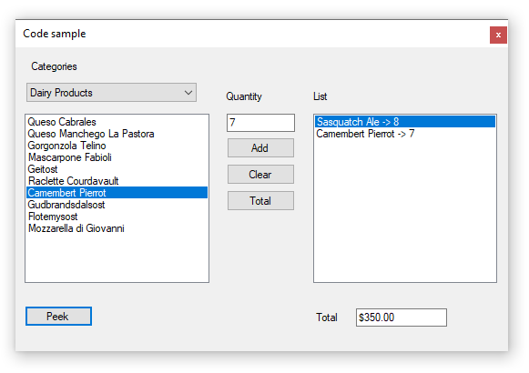

# About

This is a simple project using modified version of Microsoft NorthWind database with Entity Framework 6 code first with existing database.

Alternate to Entity Framework is to use a connection and command object then use the classes without data annotations to use a DataReader to cycle through data from SELECT statements to populate the list or single item

- There are two models, Cateogry and product along with a class which is a container for selected items.
- Created in VS2017
- BindingList is used so the right ListBox updates correctly when adding items.
- Coded in 30 minutes so there may be some clean up.
- EF AsNoTracking not used for this small of a result set.

# Important
Database script is required to run first
https://gist.github.com/karenpayneoregon/9bdf1a7d5310ac1d562b2326d79d6038

