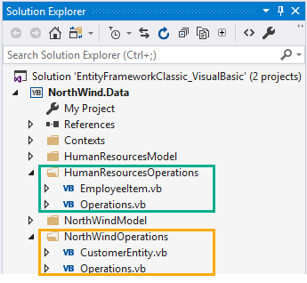

### Visual Studio: structuring an Entity Framework project

[TechNet article](https://social.technet.microsoft.com/wiki/contents/articles/53225.visual-studio-structuring-an-entity-framework-project.aspx)

### Database scripts
There are several scripts located under Solution Items with meaningful names to match up to the projects. Either run all scripts or just the ones you are interested in e.g. if working with NorthWindData run NorthWindScript.sql.

Scripts may be run inside Visual Studio via creating a new text file with .sql extension or using SSMS (SQL-Server Management Studio) which is recommended.

### Notes
> RelationsSimple is not part of the TechNet article, it's to assist with a forum question.

